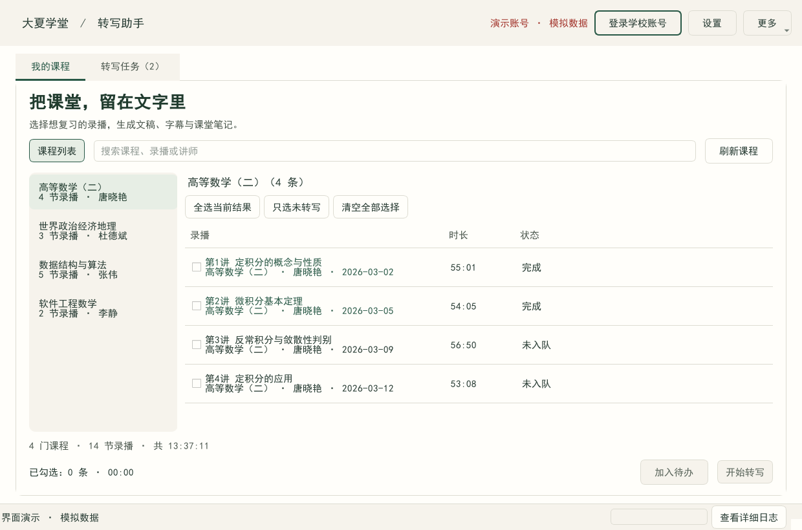

# 大夏学堂录播转写助手

> 把「我有权限看的课程录播」变成**可搜索、可复习、带时间轴的文字稿** —— 一条本地优先的 Windows 桌面流水线。

**Windows 下载：[v0.12.0 · 温暖书房](https://github.com/HMS-Victoria/ecnu_lulu/releases/tag/v0.12.0)**。完整解压 ZIP 后运行 EXE，无需安装 Python；浏览器、识别模型或云服务配置需另行准备。升级与验证范围见 [发布说明](docs/releases/v0.12.0.md)。

<p align="center">
  
  <br>
  <sub>真实 Qt 界面，演示数据离屏渲染：我的课程 → 转写任务；详细日志按需展开</sub>
</p>

<p align="center">
  
  
  
  
  
</p>

---

## 30 秒了解这个项目

一条录播的处理链路是：

```
清单(HTTP + jwt-token) → 取音频(ffmpeg / HLS / AES-128 / 断点续传)
                       → 语音识别(本地 faster-whisper 或云端 ASR)
                       → 文本加工(DeepSeek 纠错/分段/摘要)
                       → 产物(.txt / .srt / .md，UTF-8 带 BOM)
```

难点不在「调一个 API」，而在**它必须能反复跑、跑一半能停、停了能续、错了能说人话**：

| 工程问题 | 本项目的做法 |
| --- | --- |
| 拉流 40 分钟可能断 | ffmpeg `-ss` **按字节续传** + 拼接后**校验时长**；不够长就拒收，绝不把半份音频当「完成」 |
| ASR 按量计费，重跑很贵 | 音频 `sha256` 命中即**复用转写缓存**，重跑**不花第二次钱** |
| 进度条卡住没人知道 | 独立线程**看门狗**：120s 内等效速度 < 0.25× 实时就中止重试，不无限挂着 |
| 点「暂停」要等一整条跑完 | 暂停闸门作用在**任务内部的天然断点**（阶段之间/每个分段前）；ffmpeg 拉流**就地冻结**，恢复后续传 |
| 转出来是空的，到底怪谁 | 先量音频电平再下结论：「这条录像音轨几乎没声音（峰值 -66.8 dB）」≠「你的配置错了」 |
| 界面中文变乱码 | 产物默认 **UTF-8 带 BOM**（中文 Windows 的 ANSI 代码页是 cp936，无 BOM 会被猜错） |

---

## 想先看效果？一条命令，不需要账号也不需要 API Key

```powershell
.venv\Scripts\python scripts\demo_offline.py
```

这个演示会：合成两段「模拟课堂」语音 → 发布成本地 **HLS 流（一路 AES-128 加密）** →
用真实 ffmpeg 拉流取音频 → 用**本地语音识别**转成文字 → 产出 6 个文件（2 条 × txt/srt/md），
最后还会演示一次**断点续跑**（重跑不重新下载、不重复调用 ASR）。

实测输出（本机）：

```
✅ 《第1讲 绪论与算法复杂度》 AES-128 加密 → http://127.0.0.1:63012/hls/DEMO-L01/index.m3u8
✅ 《第2讲 线性表：顺序存储与链式存储》 明文   → http://127.0.0.1:63012/hls/DEMO-L02/index.m3u8
    ✅ 重跑后状态：done      ✅ 音频未重新下载：True
    ✅ ASR 调用次数：重跑前 0 → 重跑后 0（未重复调用 ✔）
完成：2/2 条任务成功，共 6 个产物文件

**[00:00:00.530]** 同学们好,今天我们讲数据结构的第一讲,训论与算法复杂读。
**[00:00:10.930]** 算法的时间复杂读用大欧记号表示,他描述的是书入规模区于无穷时运行时间的增长量级。
```

> `tiny` 模型的中文会有错别字（「绪论」→「训论」、「输入」→「书入」），
> 这正是 DeepSeek 后处理要修的；追求准确率请用 `--model small` 或 DashScope `qwen3-asr-flash`。
> 想只看产物结构不跑识别：`--asr stub`。

---

## 这个仓库里有什么值得看的

| 想看的点 | 去哪看 |
| --- | --- |
| **界面长什么样** | `assets/shots/`（主界面 + 设置页），由 `scripts/make_shots.py` 离屏真实渲染 |
| **架构 / 数据流 / 设计取舍** | [`docs/ARCHITECTURE.md`](docs/ARCHITECTURE.md) —— 含模块职责表、逐阶段数据流、13 条关键决策的备选方案对比、9 条已知限制 |
| **逆向一个真实平台的过程** | [`docs/API.md`](docs/API.md) —— 实测的登录跳转链、`jwt-token` 契约、带签名播放地址、踩坑记录（含「校外 302 不是被封」的结论更正） |
| **测试策略与「怎么证明它对」** | [`docs/ARCHITECTURE.md` §7](docs/ARCHITECTURE.md) —— 为什么集成测试要**自己造加密 HLS** |
| **一路踩过的 50+ 个坑** | [`PROGRESS.md`](PROGRESS.md)、[`CHANGELOG.md`](CHANGELOG.md) |
| **需求最初是怎么定义的** | [`docs/ORIGINAL_SPEC.md`](docs/ORIGINAL_SPEC.md) —— 项目启动时的原始目标提示词，原样保留 |

**建议阅读顺序**：本文件 → `docs/ARCHITECTURE.md` → `PROGRESS.md`（看过程）→ `docs/API.md`（看实证）。

---

## 技术栈与规模

| 层 | 选型 |
| --- | --- |
| GUI | PySide6 6.8（Qt），课程/任务两页、折叠日志，阻塞 IO 全在 `QThread`，UI 只经信号槽 |
| HTTP | httpx 0.28（同步客户端复用登录态 Cookie） |
| 登录 / 抓包 | Playwright 1.49（可见 Chromium + 持久化 profile + CDP 事件抓包） |
| 媒体 | ffmpeg（**唯一**的下载/切片/转码出口，`-vn -ac 1 -ar 16000 -c:a libmp3lame -b:a 64k`） |
| 状态 | sqlite3（WAL；`tasks` / `artifacts` / `events` 三表，显式状态机 + 启动恢复） |
| ASR | 本地 faster-whisper / 阿里云百炼 DashScope / 任意 OpenAI 兼容端点 |
| LLM | DeepSeek（可选，只改文本不改时间轴，失败不影响产物） |
| 打包 | PyInstaller `--onedir`（内嵌 ffmpeg/ffprobe） |

| 规模 | 数值 |
| --- | --- |
| 核心库 `src/ecnu_transcribe/` | ~8.0k 行 |
| 界面 `src/app/` | ~2.4k 行 |
| 测试 `tests/` | ~6.6k 行 |
| 工具与验证脚本 `scripts/` | ~4.5k 行 |
| 自动化用例 | **426 个 pytest 用例**（全部离线、fixture 驱动） |

---

## 关键设计决策（挑 6 条）

| 决策 | 备选方案 | 为什么这样选 |
| --- | --- | --- |
| **人工登录一次 + 持久化复用** | 自动填表 | 统一身份认证有验证码/二次验证；「不绕过身份验证」是硬约束 |
| **候选路径探测 + 浏览器嗅探兜底** | 硬编码单一接口 | 平台接口会变；嗅探让「接口变更」从报错变成自愈 |
| **`media` 作为唯一 ffmpeg 出口** | 各处直接 `subprocess` | 统一注入 Cookie/Header、统一 DRM 检测、统一脱敏日志、统一无窗口 |
| **LLM 只改文本不改时间轴** | 让模型重写整段 | 用「序号 → 文本」映射保证 SRT 时间戳严格不变（34 项不变量测试守着） |
| **凭据用 Windows DPAPI** | 明文 JSON / 自实现加密 | 绑定当前用户+机器，无需自管主密钥；不可用时降级为**只留内存**而非明文 |
| **`--onedir` 而非 `--onefile`** | 单文件 | 启动快、杀软误报少、便于内嵌 ffmpeg；稳定优先于体积 |

完整 13 条见 [`docs/ARCHITECTURE.md` §4](docs/ARCHITECTURE.md)。

---

## 怎么证明它是真的能跑

一共 **525 项自动化检查**，全部可复现：

| 验证套件 | 命令 | 结果 |
| --- | --- | --- |
| 单元 + 集成测试（2026-09-20） | `.venv\Scripts\python -m pytest` | **426 passed**, 1 deselected，0 failed |
| 新界面布局与对比度（2026-09-20） | `python scripts\verify_ui_layout.py --scale 1.5`（另测 1 / 1.25） | 每档 51 项通过 |
| 离线端到端（加密 HLS → 音频 → 三产物 → 续跑） | `python scripts\selftest_e2e.py` | 22 项通过 |
| 清单客户端（本地模拟平台 + 真实 HTTP） | `python scripts\mock_platform.py` | 27 项通过 |
| 暂停功能（真实流水线中途暂停/恢复/停止） | `python scripts\verify_pause.py` | 9 项通过 |
| M4 验收（驱动**真实 GUI 控件**跑完流程） | `python scripts\verify_gui.py` | 29 项通过 |
| 界面可读性（WCAG 对比度审计 + 离屏真截图） | `python scripts\verify_contrast.py` | 22 项通过 |
| 打包产物干净环境（ASCII 路径 + 无 Python 环境） | `python scripts\verify_dist.py` | 20 项通过 |
| 冻结态自检（含产物编码字节头） | `exe --doctor` | 20 项通过 |
| 「绝不编造」底线（真实素材） | `python scripts\verify_silent_honesty.py` | 8 项通过 |

除标注 2026-09-20 的两项，其余为已有版本的历史验收记录，本轮未重新执行这些独立脚本。新版 UI 的离线全流程、原生桌面实测范围和未验收项见 [发布与验证说明](docs/releases/v0.12.0.md)。

**为什么集成测试要自己造加密 HLS**：真实平台不可达时，仍需验证「HLS 分片 + AES-128 key 请求带 Cookie
+ 相对路径还原 + 时长一致性」这条最容易出错、也最影响体感的链路。用 `ffmpeg -hls_key_info_file`
本地生成加密流 + 内置 HTTP server，就能在完全离线的情况下把它测成确定性用例（实测时长偏差 0.27%）。

---

## 快速开始

### 环境要求

| 项 | 要求 |
| --- | --- |
| 操作系统 | Windows 10 / 11（x64） |
| Python（仅源码运行需要） | 3.11+（实测 3.12.13） |
| 网络 | 能访问课程平台：校内网直连；校外会先经学校 webVPN 网关，完成一次统一身份认证即可 |
| ffmpeg | 打包版已内嵌；源码运行时会自动探测（PATH / `imageio-ffmpeg` 兜底） |

### 安装

```powershell
# 1) 建虚拟环境
python -m venv .venv

# 2) 装依赖（版本已锁定）
.venv\Scripts\python -m pip install -r requirements.txt

# 3) 装 Playwright 的 Chromium（仅登录环节需要）
.venv\Scripts\python -m playwright install chromium

# 4)【可选】装本地语音识别（零成本、不需要任何 API Key）
.venv\Scripts\python -m pip install -r requirements-optional.txt

# 5) 启动
.venv\Scripts\python main.py
```

### 首次运行

1. **点顶部「登录学校账号」** → 弹出可见的 Chromium 窗口，在里面完成学校统一身份认证。
   应用**不接收、不保存密码**，遇到验证码/二次验证请手动完成；登录态自动保存复用。
2. **点「刷新课程」** → 拉取课程与录播。在「我的课程」选择课程，搜索标题或讲师，再勾选录播。刷新不会自动加入任务。
3. **设置（Ctrl+,）→ 语音识别** 二选一：
   - **零成本**：先跑 `python scripts\local_asr_server.py --model small`，
     类型选「OpenAI 兼容端点」，Base URL 填 `http://127.0.0.1:8000/v1`，API Key 留空；
   - **最准**：填阿里云百炼 DashScope 的 API Key，Base URL
     `https://dashscope.aliyuncs.com/compatible-mode/v1`，模型 `qwen3-asr-flash`。
4. 勾选录播 → **「开始转写」**。也可以先「加入待办」，稍后在「转写任务」点击「开始待办」。

运行期间加入的新待办保留到下一批，由你点击开始。「暂停」会等待当前片段结束；「继续处理选中」复用已有缓存。完成后选中任务可打开实际生成的文稿、字幕、笔记或文件夹；「更多操作 → 重新识别选中」会在确认后重新识别。

设置分为「语音识别、文字整理、文件保存、高级设置」，常用参数优先展示，其余按需展开。保存仅用于下一批，取消不会修改配置。底部「查看详细日志」可展开记录；登录过期等问题会直接显示下一步操作。

窄窗口可用「课程列表」收起侧栏，设置内容可纵向滚动。新版实施与验收记录见 [发布与验证说明](docs/releases/v0.12.0.md)。

**拿不准缺什么？点「更多 → 使用检查」（F2）。** 它会一次查完
「输出目录 / ffmpeg / 浏览器 / 网络是否通 / 登录态 / 语音识别」，每个未通过项都给出可照做的动作。

快捷键：`Ctrl+L` 登录、`F2` 使用检查、`F5` 刷新、`Ctrl+Enter` 加入待办、`Ctrl+R` 开始待办、`Ctrl+,` 设置。

---

## 关于 ASR 与 DeepSeek：这是两件事

这一节请务必读完，否则很容易踩坑。

| 环节 | 干什么 | 谁能做 |
| --- | --- | --- |
| **ASR** | 音频 → 文字 | **本地 faster-whisper（零成本、无需 Key）**、阿里云百炼 DashScope、任意 OpenAI 兼容端点 |
| **LLM** | 文字 → 更好的文字 | **DeepSeek**（`deepseek-chat` 等文本模型） |

> ⚠️ **DeepSeek 开放平台目前只有文本模型，没有 `/v1/audio/transcriptions` 这类语音转文字接口。**
> 所以**只填 DeepSeek 的 Key 是不能转写的**。DeepSeek 在这里只负责转写之后的
> 「错别字与标点修复、专业术语纠正、口语冗余清理、按语义重新分段、生成结构化摘要」。

**实测精度与速度**（19.4s 中文语音，本机 CPU 15 线程 / int8）：

| 模型 | 用时 | 实时倍率 | 准确度（参考二元组覆盖率） |
| --- | --- | --- | --- |
| `tiny` | 2.1s | 9.3× | 15%（能把句子结构切对，但错别字多） |
| `small` | 8.9s | 2.2× | 30%（关键术语基本正确） |
| `qwen3-asr-flash`（云端对照） | 2.2s | ≈27× | 简体带标点，377 字（同段本地 `small` 347 字且大量繁体） |

> `tiny`/`small` 的中文转写会出现同音字与繁简混排（例：「二叉树」→「二叉數」）。
> **这正是 DeepSeek 后处理要解决的问题** —— 打开「设置 → 文本加工」填上 DeepSeek Key 后，错别字会被修复。

> API Key 会用 **Windows DPAPI** 加密后存到 `%LOCALAPPDATA%\ecnu-transcribe\secrets.json`，
> 只能用**当前 Windows 用户**在**本机**解开。源码里、`config.json` 里、日志里都不会有明文。

---

## 用打包好的 exe

```
dist\大夏学堂转写助手\大夏学堂转写助手.exe     ← 双击即可
dist\大夏学堂转写助手\ffmpeg.exe               ← 已内嵌，无需另装
```

* 整个 `大夏学堂转写助手` 文件夹一起拷走即可（U 盘/别的电脑都行）。
* 产物目录默认在 **exe 同级的 `output\`**；日志在 `logs\`；状态库在 `data\state.db`。
* 想换位置：环境变量 `ECNU_TRANSCRIBE_HOME=<目录>`，或在设置页改输出目录。
* 配置与登录态始终在 `%LOCALAPPDATA%\ecnu-transcribe\`（不随 exe 走，升级不丢）。

自己重新打包：

```powershell
.venv\Scripts\python -m PyInstaller packaging\ecnu_transcribe.spec --noconfirm --clean
```

---

## 命令行长任务（不用 GUI）

适合排障与批量跑：

```powershell
# ① 登录（弹浏览器，人工完成认证）
.venv\Scripts\python scripts\login.py
.venv\Scripts\python scripts\login.py --capture     # 顺便抓包到 recon/network.jsonl（已脱敏）

# ② 只诊断站点可达性
.venv\Scripts\python scripts\fetch_catalog.py --diagnose

# ③ 拉全量清单 → data\catalog.json
.venv\Scripts\python scripts\fetch_catalog.py

# ④ 端到端跑一条（按清单序号）
.venv\Scripts\python scripts\run_one.py --index 2

# ⑤ 只对本地音频跑 ASR + 产物（验证端点与单价）
.venv\Scripts\python scripts\run_one.py --audio cache\media\xxx.mp3

# ⑥ 本地 ASR 服务（零成本，不需要任何 Key）
.venv\Scripts\python scripts\local_asr_server.py --model small --port 8000

# ⑦ 环境/产物自检（打包版： "dist\大夏学堂转写助手\大夏学堂转写助手.exe" --doctor）
.venv\Scripts\python scripts\doctor.py

# ⑧ 一键离线演示（不需要网络/账号/API Key）
.venv\Scripts\python scripts\demo_offline.py

# ⑨ 生成展示用界面截图（离屏真实渲染）
.venv\Scripts\python scripts\make_shots.py --out assets\shots
```

退出码约定（便于脚本判断）：`0` 成功；`1` 一般失败；`2` 登录态失效（需重新登录）；
`3` 站点不可达（校园网/VPN）；`4` 接口变更；`5` 未配置 ASR；`6` 转写失败；`7` 检测到 DRM。

---

## 目录结构

```
main.py                       源码入口
requirements.txt              依赖（版本锁定）
packaging/ecnu_transcribe.spec PyInstaller 打包配置（内嵌 ffmpeg）
src/ecnu_transcribe/          核心库
    paths.py      logbus.py    errors.py   config.py
    store.py      catalog.py   media.py    client.py
    login.py      downloader.py transcriber.py llm.py
    exporter.py   pipeline.py
src/app/                      PySide6 界面
    main.py  workers.py  ui/main_window.py  ui/settings_dialog.py  ui/theme.py
scripts/                      命令行工具与验证脚本
docs/                         ARCHITECTURE.md / API.md / ORIGINAL_SPEC.md
tests/                        426 个离线用例（fixture 驱动）
assets/shots/                 README 用的界面截图（可重新生成）
output/<课程名>/<标题>.{txt,srt,md}     ← 产物（默认）
cache/media/                  音频缓存（断点续跑用）
data/state.db                 任务状态库     data/catalog.json  清单缓存
logs/app.log                  轮转日志
%LOCALAPPDATA%\ecnu-transcribe\   ← 敏感文件都在这里，不在仓库里
    browser/           持久化浏览器用户目录（含登录态）
    storage_state.json Cookie（仅本机本用户可读）
    secrets.json       DPAPI 加密后的 API Key
    config.json        非敏感配置
```

---

## 隐私、安全与合规

* **不接收密码**：登录只在你自己面前的浏览器窗口里完成，应用从不读取密码输入框。
* **不识别验证码、不绕过验证**：出现验证码/二次验证时请手动完成。
* **不绕过 DRM**：检测到即停止并在日志里写明证据。
* **凭据加密**：API Key 用 Windows DPAPI 加密落盘（`CryptProtectData`）；
  DPAPI 不可用时**只留内存、不落盘**并显式告警。
* **日志脱敏**：Cookie / `Authorization` / token / api_key / 手机号 / 身份证 / 学号
  在写入日志与抓包文件前统一替换为 `<REDACTED>`（有专门的单元测试守着这条）。
* **不往第三方传数据**：音频与文本只发往**你自己配置**的 ASR / LLM 端点。
* **只增不改**：产物文件若已存在，覆盖前先备份为 `*.bak-时间戳`；不删除你的任何原始数据。
* **仓库里没有凭据**：`.gitignore` 覆盖 `recon/`、`storage_state.json`、`*.log`、
  `output/`、`cache/`、`.venv/`、`dist/`、`build/`。

---

## 免责声明

> **许可证范围说明**：本仓库的 MIT 许可证只覆盖**源码**，不授予任何从平台获取的
> 课程音视频与转写文本的权利 —— 那些内容的版权归授课教师与学校所有。

* 本项目仅供**个人学习与研究**使用，用于转写**你本人有权访问**的课程录播。
* 请遵守华东师范大学的校园网使用规定、课程平台的用户协议以及《著作权法》——
  课程音视频与转写文本的版权归**授课教师与学校**所有，请勿传播、公开或商用。
* 请合理控制请求频率（本应用已默认并发 ≤ 2、请求间 300–800ms 抖动），不要对学校服务器造成压力。
* 使用本应用产生的任何后果由使用者自行承担；作者不对因使用本工具导致的
  账号异常、数据丢失或版权纠纷负责。
* 本应用与华东师范大学官方无关，未获官方授权或背书。

---

## English Summary

A local-first Windows desktop tool (PySide6) that turns **course lecture recordings you legitimately
have access to** into searchable transcripts. It drives a real browser once for SSO login, reuses the
session over HTTP, resolves signed media URLs, pulls **audio only** with ffmpeg, transcribes via
**local faster-whisper** or a cloud ASR endpoint, optionally post-processes the text with DeepSeek,
and writes `.txt` / `.srt` / `.md` artifacts.

Engineered for resumability and honesty rather than happy paths: byte-range stream resume with
duration verification, ASR-cache reuse keyed on audio SHA-256, a stall watchdog, pause gates at
natural pipeline boundaries, audio-level diagnostics that distinguish "this recording is silent"
from "your config is wrong", and a redaction layer covering every log and capture file.
**426 offline tests** (one slow model test excluded). Release validation covers packaged startup, GUI behavior and security; real-service limitations are documented in the release notes.

*MIT licensed. Not affiliated with or endorsed by East China Normal University.*
